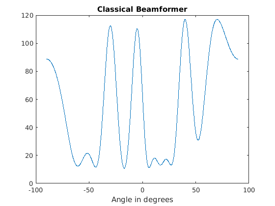
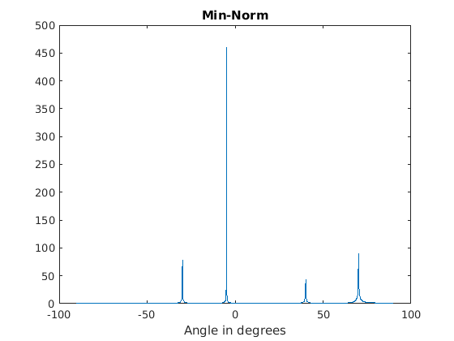
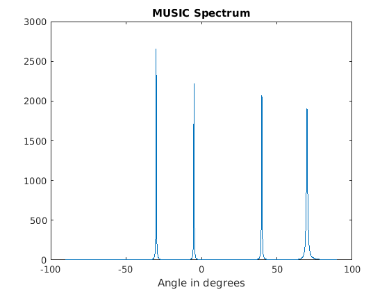

# Sound Source Localization
Classical algorithms of sound source localization with beamforming and high-resolution spectral estimation (MUSIC, ESPRIT, MVDR).

## Usage
```bash
matlab -nodesktop -nosplash –r matlabfile (name of .m)
```

## Algorithm Interpretation
* Beamforming: a spatial filtering method, is a signal processing technique used in sensor arrays for directional signal transmission or reception.
* MUSIC: Multiple Signal Classification
* ESPRIT: Estimation of Signal Parameters via Rotational Invariance Technique
* MVDR: Minimum Variance Distortionless Response


## Results
### 1. Algorithm summary
#### 1.1 Classical Beamforming


#### 1.2 Min-Norm


#### 1.3 MUSIC


#### 1.4 MVDR


### 2. Beamforming
#### 2.1 microphone array


#### 2.2 Two-dimensional map of localization result


#### 2.3 Three-dimensional map of localization result


### 3. MUSIC
#### 3.1 matlab_implement3 (**BEST**)


#### 3.2 matlab_implement1


#### 3.3 matlab_implement2


## Reference Book
* [Microphone Array Beamforming](http://www.labbookpages.co.uk/audio/beamforming.html)

## Reference Website
* [空间谱专题02：波束形成（Beamforming）](https://www.cnblogs.com/xingshansi/p/7410846.html)
* [空间谱专题10：MUSIC算法](https://www.cnblogs.com/xingshansi/p/7553746.html)
* [MUSIC算法分析和实现](https://blog.csdn.net/zhuguorong11/article/details/70209070)
* [MUSIC算法](https://blog.csdn.net/Wilder_ting/article/details/79122885)
* [子空间分析方法](http://www.cnblogs.com/xingshansi/p/7554200.html)
* [Lijiawei16/beamforming](https://github.com/Lijiawei16/beamforming)
