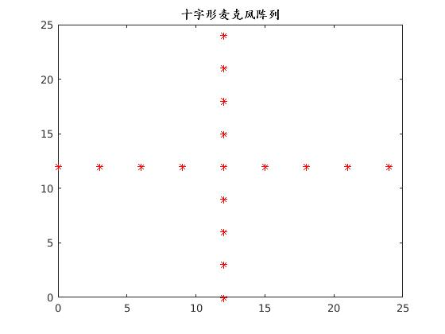
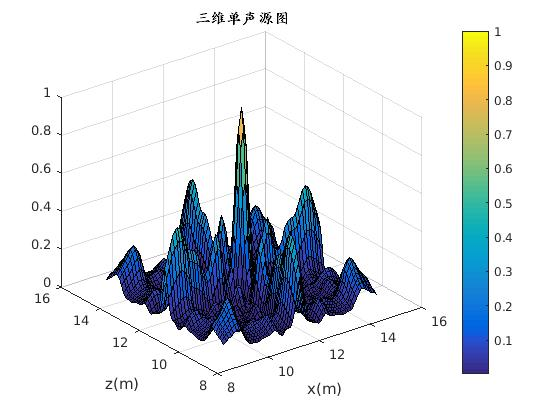

# Microphone_Array_Beamforming


## Usage
```bash
matlab -nodesktop -nosplash –r matlabfile beamforming
```

## Results
* microphone_array


* 2d map of localization result


* 3d map of localization result

