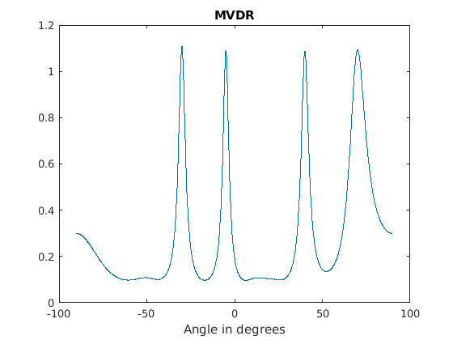
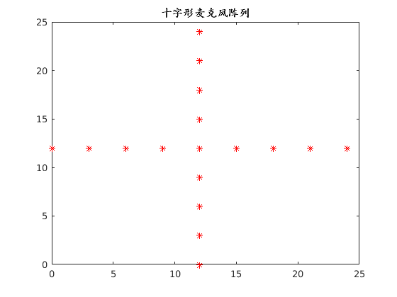
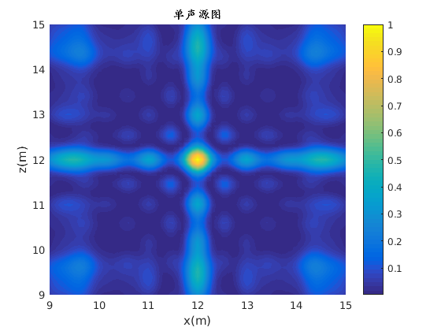
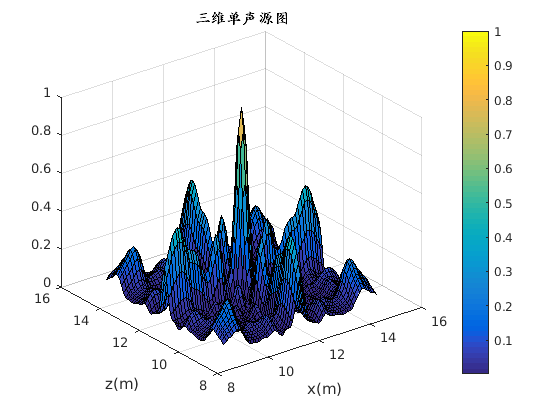
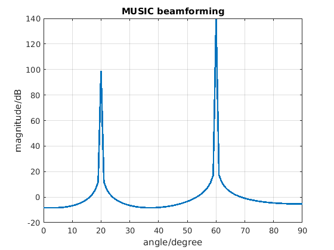
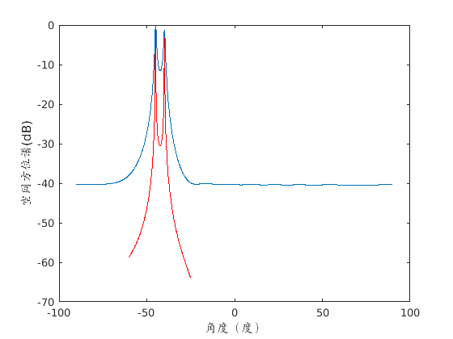
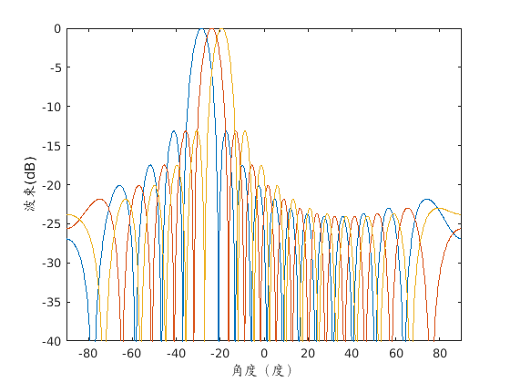

# Sound Source Localization
Classical algorithms of sound source localization with beamforming and high-resolution spectral estimation.

## Usage
```bash
matlab -nodesktop -nosplash –r matlabfile (name of .m)
```

## Algorithm Interpretation
* Beamforming: a spatial filtering method, is a signal processing technique used in sensor arrays for directional signal transmission or reception.
* MUSIC: Multiple Signal Classification
* ESPRIT: Estimation of Signal Parameters via Rotational Invariance Technique
* MVDR: Minimum Variance Distortionless Response
* GCC-PHAT: Generalized Cross Correlation Phase Transform (GCC-PHAT)

## Reference Paper
* **Title**: *Comparison of Direction of Arrival (DOA) Estimation Techniques for Closely Spaced Targets*
* **Authors**: Nauman Anwar Baig and Mohammad Bilal Malik
* **Published**: International journal of future computer and communication 2, no. 6 (2013): 654


## Results
### 1. Algorithm Summary
#### 1.1 Classical Beamforming


#### 1.2 Min-Norm


#### 1.3 MUSIC


#### 1.4 MVDR



### 2. Beamforming
#### 2.1 microphone array


#### 2.2 Two-dimensional map of localization result


#### 2.3 Three-dimensional map of localization result



### 3. MUSIC
#### 3.1 matlab_implement2 (**BEST**)


#### 3.3 matlab_implement1




## Reference Book
* [Microphone Array Beamforming](http://www.labbookpages.co.uk/audio/beamforming.html)

## Reference Website
* [空间谱专题02：波束形成（Beamforming）](https://www.cnblogs.com/xingshansi/p/7410846.html)
* [空间谱专题10：MUSIC算法](https://www.cnblogs.com/xingshansi/p/7553746.html)
* [MUSIC算法分析和实现](https://blog.csdn.net/zhuguorong11/article/details/70209070)
* [MUSIC算法](https://blog.csdn.net/Wilder_ting/article/details/79122885)
* [子空间分析方法](http://www.cnblogs.com/xingshansi/p/7554200.html)
* [Lijiawei16/beamforming](https://github.com/Lijiawei16/beamforming)
* [msamsami/doa-estimation-music](https://github.com/msamsami/doa-estimation-music)
* [rkakshay/ssl](https://github.com/rkakshay/ssl)
* [阵列信号基础之1：MUSIC算法](https://blog.csdn.net/qq_23947237/article/details/82318222)
* [基于麦克风阵列的声源定位算法之GCC-PHAT](https://www.cnblogs.com/ytxwzqin/p/9004603.html)
* [麦克风阵列声源定位GCC-PHAT](https://blog.csdn.net/u010592995/article/details/79735198)
